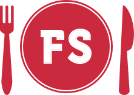

# Food Search

## Description

The purpose of this application is to allow the user to browse for restaurants with the type of food they desire and most convenient location.

## Links to repositories

* https://github.com/AMSpears/project-4-backend
* https://github.com/AMSpears/project-4-frontend

## Link to deployed app

* Food search -- http://food-searches.surge.sh/

## Technologies Uses

Express.js

React.js

Node.js

CSS

HTML

Dependencies Front-end:

* Axios
* React
* React Dom
* React Router Dom
* React Scripts

Dependencies Back-end:

* Axios
* Bcrypt
* Body Parser
* Cors
* Express
* Method-override
* Mongoose
* Nodemon
* Yelp

## Approach Taken

* Feature branches

## Features

* Yelp API

## Installation

* Fork or Clone front-end and back-end repositories
* Run npm install
* Start mongo (Backend)
* Run npm start (Frontend)

## Future Features

* Add Users
* Allow users to save and add personalize notes to their favorite restaurants and not so favorite restaurants
* Add randomize button for user to choose a restaurant of their choice

## Acknowledgements

Logo and web design by Chaz Spears
